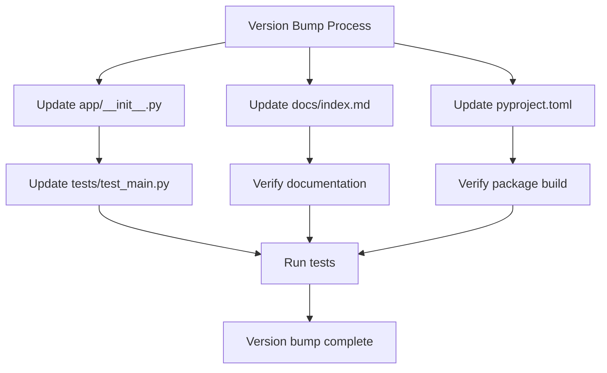

# Versioning System Analysis

## Current State Analysis

I've reviewed your versioning system and identified several issues that need to be addressed.

## Issues Found

### 1. Version Inconsistencies
- **Current version**: `0.1.1` (in [`app/__init__.py`](app/__init__.py:1))
- **Test expects**: `0.1.0` (in [`tests/test_main.py`](tests/test_main.py:15))
- **Documentation shows**: `0.1.1` (in [`docs/index.md`](docs/index.md:74))

### 2. Incomplete Bump Script
The [`scripts/bump_version.py`](scripts/bump_version.py:1) script is incomplete:
- Updates [`app/__init__.py`](app/__init__.py:1) ✅
- Updates [`docs/index.md`](docs/index.md:74) ✅
- **Missing**: Updates to [`pyproject.toml`](pyproject.toml:3) (which has `dynamic = ["version"]` but no version source)

### 3. pyproject.toml Configuration Issue
The [`pyproject.toml`](pyproject.toml:3) file uses `dynamic = ["version"]` but doesn't specify where the version should be read from. This is typically configured with:

```toml
[tool.setuptools.dynamic]
version = {attr = "app.__version__"}
```

## Required Fixes

### 1. Fix Test Version Mismatch
Update [`tests/test_main.py`](tests/test_main.py:15) to expect version `0.1.1` instead of `0.1.0`

### 2. Enhance Bump Version Script
Add pyproject.toml support to [`scripts/bump_version.py`](scripts/bump_version.py:1)

### 3. Configure pyproject.toml Properly
Add dynamic version configuration to [`pyproject.toml`](pyproject.toml:3)

## Proposed Solution



## Next Steps

1. Switch to Code mode to implement the fixes
2. Update test expectations to match current version
3. Enhance bump_version.py to handle pyproject.toml
4. Configure pyproject.toml dynamic versioning
5. Test the complete version bump workflow

The versioning system is functional but incomplete. The core mechanism works, but there are inconsistencies that need to be resolved for a fully automated version bump process.